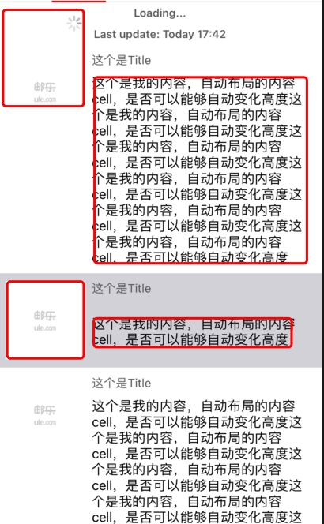

## SnapKit 使用说明

在swift中纯代码进行自动布局时，可以采用SnapKit框架，这个框架与OC中的masonry框架是类似的，很多语法都十分接近。

	extension YouLiaoCell {
	    func setUI() -> Void {
	        contentView.addSubview(iconImage)
	        contentView.addSubview(mTitleLabel)
	        contentView.addSubview(mContentLabel)
	        
	        iconImage.snp.makeConstraints { (make) in
	            make.top.left.equalTo(contentView).offset(10)
	            make.size.equalTo(100)
	            make.bottom.lessThanOrEqualTo(contentView).offset(-10)
	    
	        }
	        
	        mTitleLabel.snp.makeConstraints { (make) in
	            make.left.equalTo(iconImage.snp.right).offset(10)
	            make.top.equalTo(contentView).offset(10)
	            make.right.equalTo(contentView).offset(-10)
	        }
	        
	        mContentLabel.snp.makeConstraints { (make) in
	            make.left.equalTo(mTitleLabel)
	            make.top.equalTo(mTitleLabel.snp.bottom).offset(10)
	            make.right.equalTo(contentView).offset(-10)
	            make.bottom.equalTo(contentView).offset(-10)
	        }
	    
	        
	    }
	}

这是一个UITableViewCell 的自适应高度的布局形式，

基本的布局语法类似于masonry。

这里我们需要注意一个`lessThanOrEqualTo`

由于我们需要自适应高度，需要根据mContentLabel的内容进行自适应，所以我们在mContentLabel的约束中添加了一句

	 make.bottom.equalTo(contentView).offset(-10)
	 
这个就可以使得我们cell可以根据lable的高度来自适应调整。

但是我们发现，cell左边还有一个图片，其大小是100*100，因此会出现但mContentLabel的内容很少时，高度不足以使左边的图片显示完全。因此我们就需要对左变的UIImageView 进行约束，使其可以在Lable内容不够的时候，来进行支撑cell高度。因此我们添加了一句：

	make.bottom.lessThanOrEqualTo(contentView).offset(-10)

意思是UIIImageView距离Cell的底部最少要10个像素。

