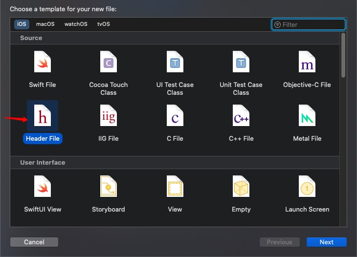
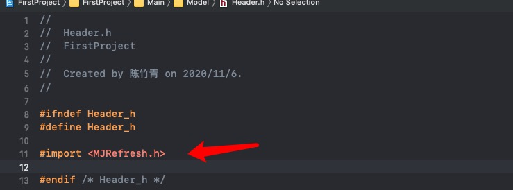
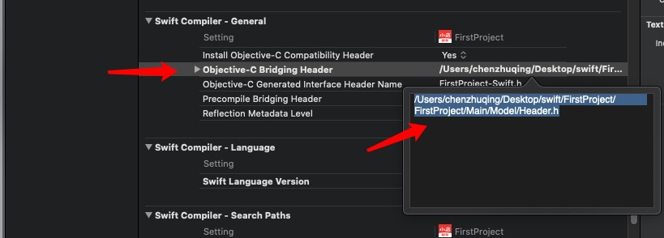

## Swift中使用MJRefresh

### 首先导入cocoaPods

在Podfile中添加

	pod "MJRefresh"

然后再终端执行

	pod install
	
### 开始链接MJRefresh文件

#### 首先创建一个新的.h文件，我们可以直接选择一个c头文件

 
 
#### 在头文件中 导入MJRefresh.h

#### 在Build Settings 里的Objective-C Bridging Header里加入Header.h的文件路径

我们可以直接把.h文件拖入到输入框中，就能直接生成路径了。

### 开始使用

	let header = MJRefreshNormalHeader()
	
		extension YouLiaoViewController {
	    func setupUI() -> Void {
	        view.addSubview(mTableView)
	        mTableView.snp.makeConstraints { (make) in
	            make.edges.equalTo(view)
	        }
	        header.setRefreshingTarget(self, refreshingAction: #selector(self.headerDragAction))
	        mTableView.mj_header = header
	    }
	    
	    @objc func headerDragAction() {
	        print("开始下拉")
	        DispatchQueue.main.asyncAfter(deadline: .now() + 10) {
	            self.header.endRefreshing()
	        }
	    }
	}

上面代码中显示我们如何使用这个MJRefresh。类似于OC的用法。，
