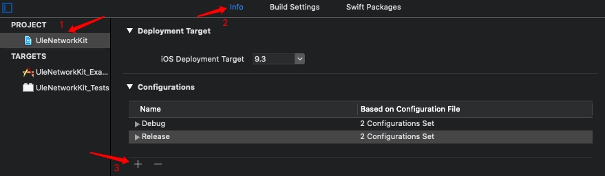
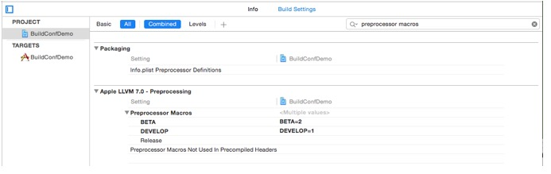
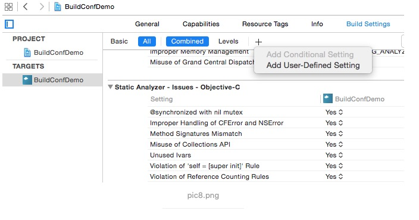
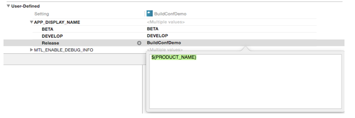

## Xcode 多Build Configuration配置使用

### 1、添加自定义的Build Configuration



### 2、 更改Preprocessor Macros



### 3、应用Build Configuration

```
#ifdef Debug
	#define kUleHost  @"http://ule.beta.com"
#elif Release
	#define kUleHost  @"http://ule.com"
#else
	#define kUleHost  @"http://ule.testing.com"
#endif
```

根据不同的编译环境切换不同的域名

### 4、修改不同环境AppName

Target - Build Settings里点+号，添加一个User-Defined Setting

比如我们请一个叫APP_DISPLAY_NAME的key值，下面BETA叫BETA，DEVELOP叫DEVELOP， Release还是用系统原配置。

进到Target - Info里，修改Bundle name为$(APP_DISPLAY_NAME)





### 5、打包的设置配置

这几天我们做了一件很蠢的事，把开发用的环境打包发给了Apple。
为了弥补这件事，顺便规范以后的打包问题，于是做了一些配置上的补救。
查了下Apple的文档，原来可以配置，我将Release环境以外的Skip Install配置成NO，就不会Archive出ipa了
