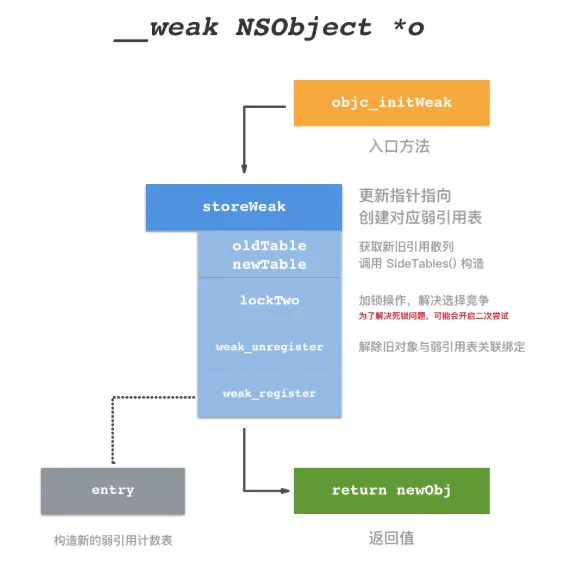
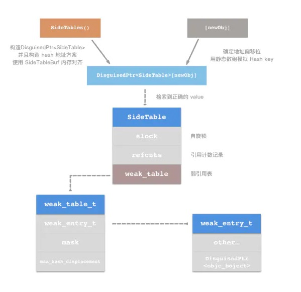

##iOS之weak底层实现原理

### 前言
在iOS开发过程中，会经常使用到一个修饰词“weak”，使用场景大家都比较清晰，用于一些对象相互引用的时候，避免出现强强引用，对象不能被释放，出现内存泄露的问题。

weak 关键字的作用弱引用，所引用对象的计数器不会加一，并在引用对象被释放的时候自动被设置为 nil。

### weak底层原理

#### 1、weak编译解析

首先需要看一下weak编译之后具体出现什么样的变化，通过Clang的方法把weak编译成C++

```
int main(){
    NSObject *obj = [[NSObject alloc] init];
    id __weak obj1 = obj;
}
```
编译之后的weak，通过`objc_ownership(weak)`实现`weak`方法，`objc_ownership`字面意思是：获得对象的所有权，是对对象weak的初始化的一个操作。

> 在使用clang编译过程中会报错误，使用下方的方法编码编译出现error
clang -rewrite-objc -fobjc-arc -stdlib=libc++ -mmacosx-version-min=10.7 -fobjc-runtime=macosx-10.7 -Wno-deprecated-declarations main.m

```
int main(){
    NSObject *obj = ((NSObject *(*)(id, SEL))(void *)objc_msgSend)((id)((NSObject *(*)(id, SEL))(void *)objc_msgSend)((id)objc_getClass("NSObject"), sel_registerName("alloc")), sel_registerName("init"));
    id __attribute__((objc_ownership(weak))) obj1 = obj;
}
```
### 2、weak的实现原理

第一、通过weak编译解析，可以看出来weak通过runtime初始化的并维护的；
第二、weak和strong都是Object-C的修饰词，而strong是通过runtime维护的一个自动计数表结构。
综上：weak是有Runtime维护的weak表。

在runtime源码中，可以找到'objc-weak.h'和‘objc-weak.mm’文件，并且在objc-weak.h文件中关于定义weak表的结构体以及相关的方法。

```
/**
 * The global weak references table. Stores object ids as keys,
 * and weak_entry_t structs as their values.
 */
struct weak_table_t {
    weak_entry_t *weak_entries; //保存了所有指向指定对象的weak指针   weak_entries的对象
    size_t    num_entries;              // weak对象的存储空间
    uintptr_t mask;                      //参与判断引用计数辅助量
    uintptr_t max_hash_displacement;    //hash key 最大偏移值
};
```
weak全局表中的存储weak定义的对象的表结构weak_entry_t，weak_entry_t是存储在弱引用表中的一个内部结构体，它负责维护和存储指向一个对象的所有弱引用hash表。其定义如下：

```
typedef objc_object ** weak_referrer_t;
struct weak_entry_t {
    DisguisedPtr<objc_object> referent;  //范型
    union {
        struct {
            weak_referrer_t *referrers;
            uintptr_t        out_of_line : 1;
            uintptr_t        num_refs : PTR_MINUS_1;
            uintptr_t        mask;
            uintptr_t        max_hash_displacement;
        };
        struct {
            // out_of_line=0 is LSB of one of these (don't care which)
            weak_referrer_t  inline_referrers[WEAK_INLINE_COUNT];
        };
    }
}
```
在 weak_entry_t 的结构中，DisguisedPtr referent 是对泛型对象的指针做了一个封装，通过这个泛型类来解决内存泄漏的问题。从注释中写 out_of_line 成员为最低有效位，当其为0的时候， weak_referrer_t 成员将扩展为多行静态 hash table。其实其中的 weak_referrer_t 是二维 objc_object 的别名，通过一个二维指针地址偏移，用下标作为 hash 的 key，做成了一个弱引用散列。

>out_of_line：最低有效位，也是标志位。当标志位 0 时，增加引用表指针纬度。
num_refs：引用数值。这里记录弱引用表中引用有效数字，因为弱引用表使用的是静态 hash 结构，所以需要使用变量来记录数目。
mask：计数辅助量。
max_hash_displacement：hash 元素上限阀值。
其实 out_of_line 的值通常情况下是等于零的，所以弱引用表总是一个 objc_objective 指针二维数组。一维 objc_objective 指针可构成一张弱引用散列表，通过第三纬度实现了多张散列表，并且表数量为 WEAK_INLINE_COUNT 。

objc_object是weak_entry_t表中weak弱引用对象的范型对象的结构体结构。

```
struct objc_object {
private:
    isa_t isa;

public:

    // ISA() assumes this is NOT a tagged pointer object
    Class ISA();

    // getIsa() allows this to be a tagged pointer object
    Class getIsa();

    // initIsa() should be used to init the isa of new objects only.
    // If this object already has an isa, use changeIsa() for correctness.
    // initInstanceIsa(): objects with no custom RR/AWZ
    // initClassIsa(): class objects
    // initProtocolIsa(): protocol objects
    // initIsa(): other objects
    void initIsa(Class cls /*indexed=false*/);
    void initClassIsa(Class cls /*indexed=maybe*/);
    void initProtocolIsa(Class cls /*indexed=maybe*/);
    void initInstanceIsa(Class cls, bool hasCxxDtor);

    // changeIsa() should be used to change the isa of existing objects.
    // If this is a new object, use initIsa() for performance.
    Class changeIsa(Class newCls);

    bool hasIndexedIsa();
    bool isTaggedPointer();
    bool isClass();

    // object may have associated objects?
    bool hasAssociatedObjects();
    void setHasAssociatedObjects();

    // object may be weakly referenced?
    bool isWeaklyReferenced();
    void setWeaklyReferenced_nolock();

    // object may have -.cxx_destruct implementation?
    bool hasCxxDtor();

    // Optimized calls to retain/release methods
    id retain();
    void release();
    id autorelease();

    // Implementations of retain/release methods
    id rootRetain();
    bool rootRelease();
    id rootAutorelease();
    bool rootTryRetain();
    bool rootReleaseShouldDealloc();
    uintptr_t rootRetainCount();

    // Implementation of dealloc methods
    bool rootIsDeallocating();
    void clearDeallocating();
    void rootDealloc();

private:
    void initIsa(Class newCls, bool indexed, bool hasCxxDtor);

    // Slow paths for inline control
    id rootAutorelease2();
    bool overrelease_error();

#if SUPPORT_NONPOINTER_ISA
    // Unified retain count manipulation for nonpointer isa
    id rootRetain(bool tryRetain, bool handleOverflow);
    bool rootRelease(bool performDealloc, bool handleUnderflow);
    id rootRetain_overflow(bool tryRetain);
    bool rootRelease_underflow(bool performDealloc);

    void clearDeallocating_weak();

    // Side table retain count overflow for nonpointer isa
    void sidetable_lock();
    void sidetable_unlock();

    void sidetable_moveExtraRC_nolock(size_t extra_rc, bool isDeallocating, bool weaklyReferenced);
    bool sidetable_addExtraRC_nolock(size_t delta_rc);
    bool sidetable_subExtraRC_nolock(size_t delta_rc);
    size_t sidetable_getExtraRC_nolock();
#endif

    // Side-table-only retain count
    bool sidetable_isDeallocating();
    void sidetable_clearDeallocating();

    bool sidetable_isWeaklyReferenced();
    void sidetable_setWeaklyReferenced_nolock();

    id sidetable_retain();
    id sidetable_retain_slow(SideTable *table);

    bool sidetable_release(bool performDealloc = true);
    bool sidetable_release_slow(SideTable *table, bool performDealloc = true);

    bool sidetable_tryRetain();

    uintptr_t sidetable_retainCount();
#if !NDEBUG
    bool sidetable_present();
#endif
};
```
总之：
1.weak_table_t(weak 全局表)：采用hash（哈希表）的方式把所有weak引用的对象，存储所有引用weak对象
2.weak_entry_t（weak_table_t表中hash表的value值，weak对象体）：用于记录hash表中weak对象
3.objc_object（weak_entry_t对象中的范型对象，用于标记对象weak对象）：用于标示weak引用的对象。

详细讲解weak存储对象结构，对接下来对weak操作使用可以更加清晰的理解weak的使用。


#### 2.2 weak底层实现原理

在runtime源码中的NSObject.mm文件中找到了关于初始化和管理weak表的方法

* *初始化weak表方法*

```
//初始化weak表
/** 
 * Initialize a fresh weak pointer to some object location. 
 * It would be used for code like: 
 *
 * (The nil case) 
 * __weak id weakPtr;
 * (The non-nil case) 
 * NSObject *o = ...;
 * __weak id weakPtr = o;
 * 
 * @param addr Address of __weak ptr. 
 * @param val Object ptr. 
 */
id objc_initWeak(id *addr, id val)
{
    *addr = 0;
    if (!val) return nil;
    return objc_storeWeak(addr, val); // 存储weak对象
}
```
* 存储weak对象的方法

```
/** 
 * This function stores a new value into a __weak variable. It would
 * be used anywhere a __weak variable is the target of an assignment.
 * 
 * @param location The address of the weak pointer itself
 * @param newObj The new object this weak ptr should now point to
 * 
 * @return \e newObj
 */
id
objc_storeWeak(id *location, id newObj)
{
    id oldObj;
    SideTable *oldTable;
    SideTable *newTable;
    spinlock_t *lock1;
#if SIDE_TABLE_STRIPE > 1
    spinlock_t *lock2;
#endif

    // Acquire locks for old and new values.
    // Order by lock address to prevent lock ordering problems. 
    // Retry if the old value changes underneath us.
 retry:
    oldObj = *location;
    
    oldTable = SideTable::tableForPointer(oldObj);
    newTable = SideTable::tableForPointer(newObj);
    
    lock1 = &newTable->slock;
#if SIDE_TABLE_STRIPE > 1
    lock2 = &oldTable->slock;
    if (lock1 > lock2) {
        spinlock_t *temp = lock1;
        lock1 = lock2;
        lock2 = temp;
    }
    if (lock1 != lock2) spinlock_lock(lock2);
#endif
    spinlock_lock(lock1);

    if (*location != oldObj) {
        spinlock_unlock(lock1);
#if SIDE_TABLE_STRIPE > 1
        if (lock1 != lock2) spinlock_unlock(lock2);
#endif
        goto retry;
    }

    weak_unregister_no_lock(&oldTable->weak_table, oldObj, location);
    newObj = weak_register_no_lock(&newTable->weak_table, newObj, location);
    // weak_register_no_lock returns nil if weak store should be rejected

    // Set is-weakly-referenced bit in refcount table.
    if (newObj  &&  !newObj->isTaggedPointer()) {
        newObj->setWeaklyReferenced_nolock();
    }

    // Do not set *location anywhere else. That would introduce a race.
    *location = newObj;
    
    spinlock_unlock(lock1);
#if SIDE_TABLE_STRIPE > 1
    if (lock1 != lock2) spinlock_unlock(lock2);
#endif

    return newObj;
}
```

* 旧对象解除注册操作 weak_unregister_no_lock

该方法主要作用是将旧对象在 weak_table 中接触 weak 指针的对应绑定。根据函数名，称之为解除注册操作。从源码中，可以知道其功能就是从 weak_table 中接触 weak 指针的绑定。而其中的遍历查询，就是针对于 weak_entry 中的多张弱引用散列表。


* 新对象添加注册操作 weak_register_no_lock

这一步与上一步相反，通过 weak_register_no_lock 函数把心的对象进行注册操作，完成与对应的弱引用表进行绑定操作

* 初始化弱引用对象流程一览

弱引用的初始化，从上文的分析中可以看出，主要的操作部分就在弱引用表的取键、查询散列、创建弱引用表等操作，可以总结出如下的流程图：



SideTable 这个结构体，是对weak_table_t表的再次封装操作，避免对weak_table_t直接操作，SideTable使用更加方便。

```
class SideTable {
private:
    static uint8_t table_buf[SIDE_TABLE_STRIPE * SIDE_TABLE_SIZE];

public:
    spinlock_t slock;
    RefcountMap refcnts;
    weak_table_t weak_table;

    SideTable() : slock(SPINLOCK_INITIALIZER)
    {
        memset(&weak_table, 0, sizeof(weak_table));
    }
    
    ~SideTable() 
    {
        // never delete side_table in case other threads retain during exit
        assert(0);
    }

    static SideTable *tableForPointer(const void *p) 
    {
#     if SIDE_TABLE_STRIPE == 1
        return (SideTable *)table_buf;
#     else
        uintptr_t a = (uintptr_t)p;
        int index = ((a >> 4) ^ (a >> 9)) & (SIDE_TABLE_STRIPE - 1);
        return (SideTable *)&table_buf[index * SIDE_TABLE_SIZE];
#     endif
    }

    static void init() {
        // use placement new instead of static ctor to avoid dtor at exit
        for (int i = 0; i < SIDE_TABLE_STRIPE; i++) {
            new (&table_buf[i * SIDE_TABLE_SIZE]) SideTable;
        }
    }
};
```
总之根据以上对weak进行存储的过程可以通过下边的流程图详细的描述出来



### 3、weak释放为nil过程


weak被释放为nil，需要对对象整个释放过程了解，如下是对象释放的整体流程：
1、调用objc_release
2、因为对象的引用计数为0，所以执行dealloc
3、在dealloc中，调用了_objc_rootDealloc函数
4、在_objc_rootDealloc中，调用了object_dispose函数
5、调用objc_destructInstance
6、最后调用objc_clear_deallocating。

对象准备释放时，调用clearDeallocating函数。clearDeallocating函数首先根据对象地址获取所有weak指针地址的数组，然后遍历这个数组把其中的数据设为nil，最后把这个entry从weak表中删除，最后清理对象的记录。

在对象被释放的流程中，需要对objc_clear_deallocating方法进行深入的分析

```
void objc_clear_deallocating(id obj) 
{
    assert(obj);
    assert(!UseGC);
    if (obj->isTaggedPointer()) return;
    obj->clearDeallocating();
}

//执行 clearDeallocating方法
inline void objc_object::clearDeallocating()
{
    sidetable_clearDeallocating();
}
// 执行sidetable_clearDeallocating，找到weak表中的value值
void  objc_object::sidetable_clearDeallocating()
{
    SideTable *table = SideTable::tableForPointer(this);
    // clear any weak table items
    // clear extra retain count and deallocating bit
    // (fixme warn or abort if extra retain count == 0 ?)
    spinlock_lock(&table->slock);
    RefcountMap::iterator it = table->refcnts.find(this);
    if (it != table->refcnts.end()) {
        if (it->second & SIDE_TABLE_WEAKLY_REFERENCED) {
            weak_clear_no_lock(&table->weak_table, (id)this);
        }
        table->refcnts.erase(it);
    }
    spinlock_unlock(&table->slock);
}
```
对weak置nil的操作最终调用执行weak_clear_no_lock方法用于执行置nil的操作。执行方法如下：

```
/** 
 * Called by dealloc; nils out all weak pointers that point to the 
 * provided object so that they can no longer be used.
 * 
 * @param weak_table 
 * @param referent The object being deallocated. 
 */
void 
weak_clear_no_lock(weak_table_t *weak_table, id referent_id) 
{
    objc_object *referent = (objc_object *)referent_id;

    weak_entry_t *entry = weak_entry_for_referent(weak_table, referent);
    if (entry == nil) {
        /// XXX shouldn't happen, but does with mismatched CF/objc
        //printf("XXX no entry for clear deallocating %p\n", referent);
        return;
    }

    // zero out references
    weak_referrer_t *referrers;
    size_t count;
    
    if (entry->out_of_line) {
        referrers = entry->referrers;
        count = TABLE_SIZE(entry);
    } 
    else {
        referrers = entry->inline_referrers;
        count = WEAK_INLINE_COUNT;
    }
    
    for (size_t i = 0; i < count; ++i) {
        objc_object **referrer = referrers[i];
        if (referrer) {
            if (*referrer == referent) {
                *referrer = nil;
            }
            else if (*referrer) {
                _objc_inform("__weak variable at %p holds %p instead of %p. "
                             "This is probably incorrect use of "
                             "objc_storeWeak() and objc_loadWeak(). "
                             "Break on objc_weak_error to debug.\n", 
                             referrer, (void*)*referrer, (void*)referent);
                objc_weak_error();
            }
        }
    }
    
    weak_entry_remove(weak_table, entry);
}

```
objc_clear_deallocating该函数的动作如下：

1、从weak表中获取废弃对象的地址为键值的记录
2、将包含在记录中的所有附有 weak修饰符变量的地址，赋值为nil
3、将weak表中该记录删除
4、从引用计数表中删除废弃对象的地址为键值的记录

其实Weak表是一个hash（哈希）表，然后里面的key是指向对象的地址，Value是Weak指针的地址的数组。

### 总结
weak是Runtime维护了一个hash(哈希)表，用于存储指向某个对象的所有weak指针。weak表其实是一个hash（哈希）表，Key是所指对象的地址，Value是weak指针的地址（这个地址的值是所指对象指针的地址）数组。


当一个对象obj被weak指针指向时，这个weak指针会以obj作为key，被存储到sideTable类的weak_table这个散列表上对应的一个weak指针数组里面。

当一个对象obj的dealloc方法被调用时，Runtime会以obj为key，从sideTable的weak_table散列表中，找出对应的weak指针列表，然后将里面的weak指针逐个置为nil


