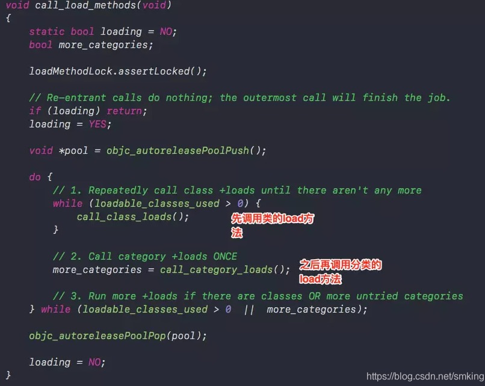

## 面试
### 1、介绍一下runtime的内存模型（isa、对象、类、metaclass、结构体的存储信息等）

首先我们知道Objective-C是一门动态语言。他是将静态语言在编译和链接时期做的事情放到了运行时来处理。所以动态语言的优势是，代码更具有灵活性，我们可以把消息转发给我们想要的对象，或者随意交换一个方法的实现等。

`Class` 实际上是一个指向objc_class结构体的指针。他的定义如下：

	struct objc_class {
    Class _Nonnull isa  OBJC_ISA_AVAILABILITY;

	#if !__OBJC2__
	    Class _Nullable super_class                              OBJC2_UNAVAILABLE;
	    const char * _Nonnull name                               OBJC2_UNAVAILABLE;
	    long version                                             OBJC2_UNAVAILABLE;
	    long info                                                OBJC2_UNAVAILABLE;
	    long instance_size                                       OBJC2_UNAVAILABLE;
	    struct objc_ivar_list * _Nullable ivars                  OBJC2_UNAVAILABLE;
	    struct objc_method_list * _Nullable * _Nullable methodLists                    OBJC2_UNAVAILABLE;
	    struct objc_cache * _Nonnull cache                       OBJC2_UNAVAILABLE;
	    struct objc_protocol_list * _Nullable protocols          OBJC2_UNAVAILABLE;
	#endif
	
	} OBJC2_UNAVAILABLE;

需要注意的是：

`isa ` ： objective-C中任何类的定义都是对象，<mark>类和类的实例没有任何实质上的区别</mark>，任何对象都一个isa指针。他是一个Class类型的指针，每个实例对象有一个isa的指针，指向对象的类，而Class里面也有一个isa的指针，指向meteClass。metaClass保存了类方法的列表。当类方法被调用的时候，会先从本身查找类方法的实现，如果没有，meteClass会想他父类查找该方法。

所以理解为： 对象（Object）.isa  -> 类（Class）.isa -> 元类metaclass

`super_class`：指向其父类，如果该类为根类则为NULL

`info`: 供运行期使用的一些位标识

`ivars`: 成员变量的数组

`instance_size`：该类的实例变量大小

`objc_method_list `: 类的方法列表

`objc_ivar_list `: 属性列表

`objc_protocol_list `：协议列表	

`cache `:

那么什么是类？在xcode中用快捷键Shift+Cmd+O打开objc.h, 能看到类定义：

	/// An opaque type that represents an Objective-C class.
	typedef struct objc_class *Class;
	
	/// Represents an instance of a class.
	struct objc_object {
	    Class _Nonnull isa  OBJC_ISA_AVAILABILITY;
	};
	
	/// A pointer to an instance of a class.
	typedef struct objc_object *id;
	#endif
	
	/// An opaque type that represents a method selector.
	typedef struct objc_selector *SEL;
	
	/// A pointer to the function of a method implementation. 
	#if !OBJC_OLD_DISPATCH_PROTOTYPES
	typedef void (*IMP)(void /* id, SEL, ... */ ); 
	#else
	typedef id _Nullable (*IMP)(id _Nonnull, SEL _Nonnull, ...); 

可以看出Class 其实是一个objc_class的结构类型的指针。id也是一个结构类型的指针。

metaclass : 就像Class一样，也是一个对象。你依旧可以向它发送消息调用函数，metaclass也会有一个isa指针指向其所属类。同样也会有一个superclass指向父类的metaclass，所有的metaclass使用基类的metaclas作为他们的所属类。具体而言，任何NSObject继承下的metaclass都使用NSObject的metaclass左右自己的所属类。

###  2、为什么要设计metaclass
* 类对象，元类对象能够复用消息发送流程机制
* 单一职责原则

### 3、@dynamic属性的作用，以及应用场景
`@dynamic` 定义的属性，表示该属性，需要用户自己定义`getter`以及`setter`方法。
`@synthesize` 定义的属性，则表示用户不需要自己定义`getter`以及`setter`方法，系统会自动生成这两个方法。
category中添加属性时使用，我们知道类的分类可以通过runtime的形式，添加新的方法，因此利用dynamic的特性，我们可以给category添加属性，并且在.m文件中，用@dynamic来标注属性，然后再通过runtime的形式添加getter和setter属性。

### 4、class_copyIvarList和class_copyPropertyList区别

`class_copyPropertyList `返回的仅仅是对象类的属性（@property申明的属性以及category/extension 中的属性），

`class_copyIvarList` 返回的所有属性和变量（包括@interface大括号中声明的变量）
### 5、分类Category是如何被加载的，两个category的load方法加载顺序，两个category的同名方法的加载顺序。

回答这个问题之前，首先我们先思考三个问题：

* Category的实现原理是什么，以及category为什么只能加方法不能加属性。
	
	分类的实现原理是将category中的方法属性协议等数据放在category_t结构体中，然后将结构体内的方法列表拷贝到类对象中，<mark>特别注意的是方法列表拷贝到类对象中的方法列表中所在的位置是放在原有的类中的方法列表的前面，因此才有category中的方法能够覆盖类中方法的，其实并没有覆盖只是将category中的方法放在前面了</mark>，
	
	那分类中能添加属性吗？答案是<mark>能够添加属性</mark>，上面我们说了，分类中属性会添加在category_t的结构体中，只是分类中的属性不会自动生成set/get方法。因为category_t结构体中并不存在成员变量。通过之前对对象的分析我们知道成员变量是存放在实例对象中的，并且编译的那一刻就已经决定好了。而分类是在运行时才去加载的。那么我们就无法再程序运行时将分类的成员变量中添加到实例对象的结构体中。<mark>因此分类中不可以添加成员变量。</mark>

* Category中有load方法吗？load方法是什么时候调用的？load方法能继承吗？
load 方法是在程序启动的时候就调用了。查看源代码。

通过源码我们发现是系统优先调用类的load方法，之后调用分类的load方法。
load方法可以被继承，在调用子类的load之前，先调用父类的load
* load、initialize的区别，以及他们在cagegory重写的时候的调用次序。

	区别在于调用方式和调用时刻
	`调用方式`：load是根据函数地址直接调用，initialize是通过objc_msgSend调用
	`调用时刻`：load是runtime加载类、分类的时候调用（只会调用1次），initialize是类第一次接收到消息的时候调用，每一个类只会initialize一次（父类的initialize方法可能会被调用多次）
	`调用顺序`：先调用类的load方法，先编译那个类，就先调用load。在调用load之前会先调用父类的load方法。分类中load方法不会覆盖本类的load方法，先编译的分类优先调用load方法。initialize先初始化父类，之后再初始化子类。如果子类没有实现+initialize，会调用父类的+initialize（所以父类的+initialize可能会被调用多次），如果分类实现了+initialize，就覆盖类本身的+initialize调用。
	
`+load `方法是 `images` 加载的时候调用，假设有一个 Person 类，其主类和所有分类的 +load 都会被调用，优先级是先调用主类，且如果主类有继承链，那么加载顺序还必须是基类的 +load ，接着是父类，最后是子类；category 的 +load 则是按照编译顺序来的，先编译的先调用，后编译的后调用

### 6、category和extension的区别，能给NSObject添加Extension吗？

category：

1、运行时添加属性方法协议等信息，并在最终将方法拷贝到类的方法列表中，其他在category_t的结构体重。

2、分类添加的方法会‘覆盖’原类方法，其实不是覆盖是分类中方法被拷贝到了原类方法列表的前面，因此在执行的时候，就先执行了分类中的方法。

3、同名分类方法谁生效取决与编译顺序，因为image读取的信息是倒序的，所以编译越靠后的越先读取。

extension:

1、编译是定义

2、只以声明的形式存在，多数情况下就存在.m文件中

3、不能为系统类添加扩展。
### 7、消息转发机制，消息转发机制和其他语言的消息转发机制优劣对比

主要说清楚消息转发的过程有哪些。

1 、<mark>消息传递调用`objc_msgSend`</mark>

2、<mark>在类对象的`cache`中查找`IMP`，然后再`methodList`中查找，如果找到`IMP`则执行方法调用，否则下一步

3、<mark>进入动态绑定（`resolveInstanceMethod`、`resolveClassMethod`） </mark>  
我们可以通过重写 `+ (BOOL) resolveInstanceMethod:(SEL)sel `和`+ (BOOL)resolveClassMethod:(SEL)sel `方法，来动态对实例对象和类对象添加一个新的方法。返回值为YES 则是执行添加的方法，返回值为NO，则是执行消息转发机制。
 
 	resolveInstanceMethod: 这个是对实例对象添加动态方法。
	resolveClassMethod：这个是对类对象添加动态方法。
4、<mark>`forwardingTargetForSelector`  正式进入消息转发阶段，指定特定对象执行消息

在消息转发之前呢，系统会调用`forwardingTargetForSelector` 方法，该方法是将消息转发给一个特定的对象去执行，如果没有设置的话则继续进行消息转发，一旦设置新的消息接收的对象，则会进行到新的对象中去执行。

5、<mark>如果上述过程中，没有指定任何对象则进入转发`methodSignatureForSelector`阶段。

methodSignatureForSelector 会对对象的方法进行签名。如果签名成功，则表明该对象可以执行这个签名方法。然后再forwardInvocation中进行调用。

	+ (NSMethodSignature *)methodSignatureForSelector:(SEL)aSelector{
	    NSMethodSignature * signature= [super methodSignatureForSelector:aSelector];
	    if (!signature) {
	        Class metaClass=objc_getMetaClass(class_getName([B class]));
	        signature= [[metaClass class] instanceMethodSignatureForSelector:aSelector];
	    }
	    return signature;
	}

注意最后类签名的时候用的是instanceMethodSignatureForSelector方法
	
	+ (void)forwardInvocation:(NSInvocation *)anInvocation {
	    [anInvocation invokeWithTarget:[B class]];
	}

### 8、在方法调用的时候，方法查询-> 动态解析-> 消息转发 之前做了什么
这个在第七个题目有说明了。
### 9、IMP、SEL、Method的区别和使用场景
首先我们从定义开始

	typedef struct method_t *Method;
	
	using MethodListIMP = IMP;
	
	struct method_t {
	    SEL name;
	    const char *types;
	    MethodListIMP imp;
	};
	
从定义中我们可以看出，

Method是一个method_t的结构体，里面包含了IMP和SEL，实际是是对IMP和SEL之间做了一个一对一的映射。从而使SEL能找到IMP的实现。

IMP是一个方法的实现首地址，类似c语言的函数指针，

SEL 又叫选择器，是表示一个方法的selector的指针，是一个方法的编号。 用于表示运行时方法的名字，Objective-C在编译时，会依据每一个方法的名字、参数序列，生成一个唯一的标识，这个标识就是SE

### 10、load、initialize方法的区别是什么，在继承关系中他们有什么不同？

这个在题目5中已经有具体说明。

### 11、weak的实现原理，`SideTable `的结构是什么样的
weak 关键字修饰的属性或者变量为什么在对应类实例dealloc后会置为nil，那是因为在类实例释放的时候，dealloc 会从全局的引用计数和weak计数表sideTables中，通过实例地址去找到属于自己的那张表，表中的 weak_table->weak_entries 存储了所有 entry 对象——其实就是所有指向这个实例对象的变量，weak_entry_t 中的 referrers 数组存储的就是变量或属性的内存地址，逐一置为nil即可。

### 12、关联对象的应用？系统如何实现关联对象的

基本使用：
	
	#import <objc/runtime.h>
	
	static NSString * const kKeyOfImageProperty;
	
	@implementation UIView (Image)
	
	- (UIImage *)pt_image {
	    return objc_getAssociatedObject(self, &kKeyOfImageProperty);
	}
	
	- (void)setPTImage:(UIImage *)image {
	    objc_setAssociatedObject(self, &kKeyOfImageProperty, image,OBJC_ASSOCIATION_RETAIN);
	}
	@end

应用：

* 为Class添加私有成员：例如在AFNetworking中，在UIImageView里添加了imageRequestOperation对象，从而保证了异步加载图片。
* 为Class添加共有成员：例如在FDTemplateLayoutCell中，使用Associated Objects来缓存每个cell的高度（代码片段1、代码片段2）。通过分配不同的key，在复用cell的时候即时取出，增加效率。
* 创建KVO对象：建议使用category来创建关联对象作为观察者。可以参考Objective-C Associated Objects这篇文的例子

### 13、`Autoreleasepool`的原理？所使用的的数据结构是什么

基于栈为节点（node）的双向链表，使用 @autoreleasePool 包裹的作用域中，所有调用 autorelease 都会将对象push到自动释放池，作用域结束就会drain一次，这里涉及到了 哨兵对象，也就是 插入一个nil标识。

这个不太懂具体怎么弄，只要能说出在一个自动释放池中，可以主动释放对象。

### 14 、`ARC`的实现原理？ARC下对retain & release做了哪些优化

ARC 是 LLVM 和 Runtime 协作的结果，ARC 中禁止调用 retain/release/retainCount/dealloc方法，新增weak strong。MRC 是手动管理内存。

简单地说，就是代码中自动加入了retain/release，原先需要手动添加的用来处理内存管理的引用计数的代码可以自动地由编译器完成了。ARC并不是GC，它只是一种代码静态分析（Static Analyzer）工具.比如如果不是 alloc/new/copy/mutableCopy 开头的函数，编译器会将生成的对象自动放入 autoreleasePool 中。如果是 __strong 修饰的变量，编译器会自动给其加上所有权。等等，详细，我们根据不同的关键字来看看编译器为我们具体做了什么。并从中总结出 ARC 的使用规则。

### 15、ARC什么情况下会内存泄漏
* 循环引用
* CF类型、C语言malloc出来的对象，没有及时释放内存。
* 单例

### 16、Method Swizzle 注意事项

* 很明显方法混写的代码要完整的执行，程序才会正常执行，正如我们在+load方法中执行dispatch once。

* 混写的方法不止对一个实例有效，是对目标类的所有实例。我们改变了目标类，所以swizzling是很重要的事，要十分小心。

* 命名冲突贯穿整个Cocoa的问题，我们常常在类名和类别方法名前加上前缀，所以我们也在新方法的前面加前缀，就像前面代码里的-xxx_setTag:。但如果-xxx_setTag:在别处也定义了怎么办？这个问题不仅仅存在于swizzling，这我们可以用别的变通的方法：

* 直接用新的 IMP 取代原 IMP ，而不是替换。只需要有全局的函数指针指向原 IMP 就可以。

* 多个swizzle方法的执行顺序也需要注意。那么应该是什么顺序呢，从父类->子类的顺序交换，还是从父类->子类的顺序？

* 新方法的实现看起来像递归，但是看看上面已经给出的 swizzling 封装方法, 使用起来就很易读懂。

* 调试困难，使用NSStringFromSelector(_cmd)打印出的方法名调用的方法名，__FUNCTION__打印出的方法名是真正实现的方法名。这块可能会混乱，毕竟交换了方法，就像A的实现是B，B的实现是A，不是平常看到的代码那么直接，这块需要思考，一不小心就会忘了。

### 17、属性修饰符atomic的内部实现是怎么样的?能保证线程安全吗

atomic 表示该属性是原子的，他是系统自动给该属性添加了一个@synchronized 自旋锁。例如：

	@property ( assign, atomic) int age;

    -(void) setAge:( int ) age{
             @synchronized( self) {
                         _age=age;
               }
    }
这个能够有效防止因多线程抢夺资源造成线程数据安全问题。
但是要消耗大量的cpu资源。
****
### 18、NSNotification 相关
查看关于通知的文档。
1、通知的发送是同步的，还是异步的
答：通知发送是同步的。

2、NSNotificationCenter接受消息和发送消息是在一个线程里吗？如何异步发送消息
答：是在一个线程中。使用NSNotificationQueue队列，利用runloop合适的时间发送消息。
3、NSNotificationQueue是异步还是同步发送？在哪个线程响应
答：异步，
4、NSNotificationQueue和runloop的关系
答：这个是异步发送通知时，添加到队列中等待发送，在runloop中触发发送
5、如何保证通知接收的线程在主线程
答：使用addObserverForName: object: queue: usingBlock方法注册通知，指定在mainqueue上响应block
6、页面销毁时不移除通知会崩溃吗
答：会
7、多次添加同一个通知会是什么结果？多次移除通知呢
答：会多次响应。删除一次会将多次注册的通知全部删除，多次删除没有影响，后面的删除就没有实际作用了，但不影响。
8、下面的方式能接收到通知吗？为什么

	// 发送通知
	[[NSNotificationCenter defaultCenter] addObserver:self selector:@selector(handleNotification:) name:@"TestNotification" object:@1];
	// 接收通知
	[NSNotificationCenter.defaultCenter postNotificationName:@"TestNotification" object:nil];

不能收到通知，因为定义的添加通知设置了name和object，而且发送通知的时候却只指定了name，因此在name 和object两个维度来查找需要发送的通知，这时是找不到了的。因此接收不了通知，

## Runloop& kVO

### 19、app如何接收到触摸事件

[Hti-Testing 响应链](https://www.jianshu.com/p/70ba981317b6)

### 20、为什么只有主线程的runloop是开启的
主线程是默认开启runloop的，而自定义线程需要调用 [NSRunloop currentRunloop] 就会开启runloop。

### 21、为什么只有在主线程刷新UI
参考[《iOS拾遗——为什么必须在主线程操作UI》](https://juejin.im/post/6844903763011076110)
### 22、PerformSelector和runloop的关系
performSelector 是一个同步的操作，而且他是在runloop 中激发调用的。如果在子线程中调用performSelector方法，没有开启runloop的时候，是调用不了的，只有开启了runloop才会执行。

例如：

	dispatch_queue_t queue=dispatch_get_global_queue(DISPATCH_QUEUE_PRIORITY_DEFAULT, 0);
    //    dispatch_queue_t queue = dispatch_queue_create("Testing_queue", DISPATCH_QUEUE_CONCURRENT);
    dispatch_async(queue, ^{
				        NSLog(@"[1] 线程：%@",[NSThread currentThread]);
				        NSTimer * timer = [NSTimer timerWithTimeInterval:1 repeats:YES block:^(NSTimer * _Nonnull timer) {
				            NSLog(@"timer 定时任务");
				        }];
				        addRunLoopObserver();
				        NSRunLoop *runloop = [NSRunLoop currentRunLoop];
				        [runloop addTimer:timer forMode:NSDefaultRunLoopMode];
				        [self performSelector:@selector(perform) withObject:nil afterDelay:0];
	     
	        [runloop run];
	        NSLog(@"[3]");
	    });
	
### 23、如果是一个线程长活

上面说到在线程中开启runloop，

### 34、KVO 原理
KVO 会为需要observed的对象动态创建一个子类，以NSKVONotifying_ 最为前缀，然后将对象的 isa 指针指向新的子类，同时重写 class 方法，返回原先类对象，这样外部就无感知了；其次重写所有要观察属性的setter方法，统一会走一个方法，然后内部是会调用 willChangeValueForKey 和 didChangevlueForKey 方法，在一个被观察属性发生改变之前， willChangeValueForKey:一定会被调用，这就 会记录旧的值。而当改变发生后，didChangeValueForKey:会被调用，继而 observeValueForKey:ofObject:change:context: 也会被调用。

### 35、block的内部实现，结构体是什么样的

block 也是一个对象，主要分为 Imp 结构体 和 Desc 结构体，用 `clang -rewrite-objc` 命令将 oc 代码重写成 c++:

	struct __block_impl {
	  void *isa;
	  int Flags;
	  int Reserved;
	  void *FuncPtr;
	};
	
	struct __main_block_impl_0 {
	  struct __block_impl impl;
	  struct __main_block_desc_0* Desc;
	  __main_block_impl_0(void *fp, struct __main_block_desc_0 *desc, int flags=0) {
	    impl.isa = &_NSConcreteStackBlock;
	    impl.Flags = flags;
	    impl.FuncPtr = fp;
	    Desc = desc;
	  }
	};

### 36、block类型有哪些？
一般，block有三种：_NSConcreteGlobalBlock、_NSConcreteStackBlock、_NSConcreteMallocBlock，根据Block对象创建时所处数据区不同而进行区别。

1、栈上 Block，引用了栈上变量，生命周期由系统控制的，一旦所属作用域结束，就被系统销毁了。
2、堆上 Block，使用 copy 或者 strong（ARC）下就从栈Block 拷贝到堆上。
3、全局 Block，未引用任何栈上变量时就是全局Block;

### 37、一个int变量被 __block 修饰与否的区别？block的变量截获

一个Int变量被__block修饰后，便可以在block内部对这个变量进行修改操作。

如果没有被__block修饰，那么在block内部，其实是对int变量进行值的拷贝，如果加了__block修饰，那么就会把int变量的指针传入到block内部，因此可以在block中对变量进行操作。

外部变量有四种类型：自动变量、静态变量、静态全局变量、全局变量。

全局变量和静态全局变量在 block 中是直接引用的，不需要通过结构去传入指针；

函数/方法中的 static 静态变量是直接在block中保存了指针，如下测试代码：

	nt a = 1;
	static int b = 2;
	
	int main(int argc, const char * argv[]) {
	
	    int c = 3;
	    static int d = 4;
	    NSMutableString *str = [[NSMutableString alloc]initWithString:@"hello"];
	    void (^blk)(void) = ^{
	        a++;
	        b++;
	        d++;
	        [str appendString:@"world"];
	        NSLog(@"1----------- a = %d,b = %d,c = %d,d = %d,str = %@",a,b,c,d,str);
	    };
	    
	    a++;
	    b++;
	    c++;
	    d++;
	str = [[NSMutableString alloc]initWithString:@"haha"];
	    NSLog(@"2----------- a = %d,b = %d,c = %d,d = %d,str = %@",a,b,c,d,str);
	    blk();
	    
	    return 0;
	}

### 38、block在修改NSMutableArray，需不需要添加__block

不需要添加__block，因为block会直接获取NSMutableArray的指针。

### 39、block可以用strong修饰吗

可以的，因为block 通过strong，copy操作后都是将栈上的block拷贝到堆上了。

### 40、解决循环引用时为什么要用__strong、__weak修饰

__weak 就是为了避免 retainCycle，而block 内部 __strong 则是在作用域 retain 持有当前对象做一些操作，结束后会释放掉它

### 41、block发生copy时机

block 从栈上拷贝到堆上几种情况：

1、调用Block的copy方法

2、将Block作为函数返回值时

3、将Block赋值给__strong修饰的变量或Block类型成员变量时

4、向Cocoa框架含有usingBlock的方法或者GCD的API传递Block参数时

### 42、Block访问对象类型的auto变量时，在ARC和MRC下有什么区别？

### 43、